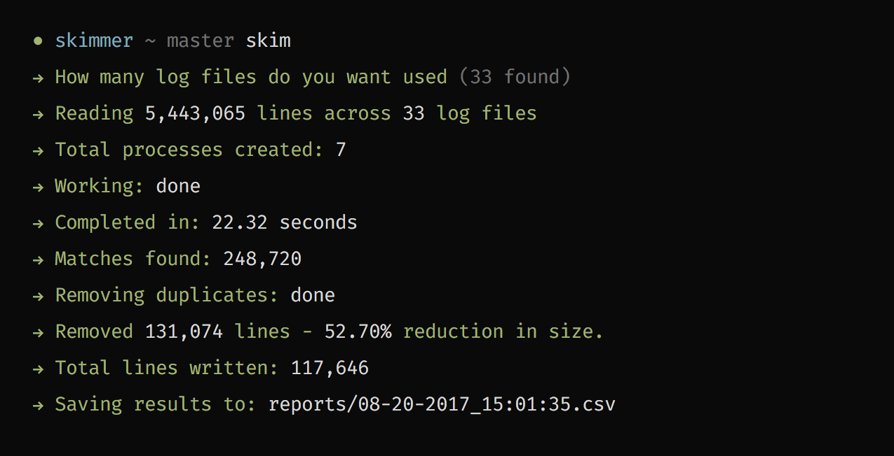

<p align="center">
    
</p>

# Skimmer
Skimmer is an IIS log parser written in Python for speed and customized with JSON for fun. Turning that frown upside down, one parsed, read, sorted and converted log file at a time.

## Usage

**`--file, --files, -f`**  
By default, the log files read are those located in the `logs/*.log` location. Using one of the file flags above, you can specify a file or collection of files to use instead of the default location:

``` shell
# Skim one file
skim -f logs/foo.log

# Skim multiple files from a different collection
skim -f "foo/bar/*.log"
```

## Custom reports
Inside the root `config.json` file there are three keys that are used within Skimmer. The order of the keys in the arrays are paramount to the skimmer operating properly so don't change the order or remove any keys.

**`template`**  
The `template` array tells the skimmer what columns to save to the reported CSV file. That way you can ignore columns that aren't important such as `sc-bytes` or something like that.

**`limits`**  
The `limits` array tells the Skimmer to limit results that have a value at the specified column. For example, we can limit results that have a `cs-uri-stem` containing either `/foo-bar` or `/foo/bar/baz` with the following:

``` json
"limits": {
    "cs-uri-stem": ["/foo-bar", "/foo/bar/baz"],
}
```

If we specify values in multiple limitation keys, it will ensure there is at least one match in both keys. Let's say I'm looking for pages with the `cs-uri-stem` containing either `/foo-bar` or `/foo/bar/baz` _BUT_ also limit those matches to requests that have `sc-status` of `404` or `503`:

``` json
"limits": {
    "cs-uri-stem": ["/foo-bar", "/foo/bar/baz"],
    "sc-status": ["404", "503"]
}
```

We can also supply regular expressions to match against. The value will be considered an expression when it starts and ends with a forward slash.

``` json
"limits": {
    "cs-uri-stem": ["/foo(-bar|\/bar\/baz)/"]
}
```


**`exclusions`**  
Similar to limitations, but with the oppositite affect. Let's use the same limitations shown above but we'll exclude internal traffic. In this example, internal traffic will be recognized as the IP `12.34.56.78`:

``` json
"limits": {
    "cs-uri-stem": ["/foo-bar", "/foo/bar/baz"],
    "sc-status": ["404", "503"]
},
"exclusions": {
    "c-ip": ["12.34.56.78"]
}
```

Much like `limitations`, we can also supply regular expressions to match against. The value will be considered an expression when it starts and ends with a forward slash. In this case, if the expression finds a match, it negates that row and continues forward:

``` json
"limits": {
    "cs-uri-stem": ["/foo-bar", "/foo/bar/baz"],
    "sc-status": ["404", "503"]
},
"exclusions": {
    "c-ip": ["/[0-9]{1,3}\\.?/"]
}
```

## Columns
| Name                | Key               | Description                                                                                                                                |
|---------------------|-------------------|--------------------------------------------------------------------------------------------------------------------------------------------|
| Date                | `date`            | The date on which the request occurred.                                                                                                    |
| Time                | `time`            | The time, in Coordinated Universal Time (UTC), at which the request occurred.                                                              |
| Client IP Address   | `c-ip`            | The IP address of the client that made the request.                                                                                        |
| User Name           | `cs-username`     | The name of the authenticated user who accessed your server. Anonymous users are indicated by a hyphen.                                    |
| Service Name        | `s-sitename`      | The site instance number that fulfilled the request.                                                                                       |
| Server Name         | `s-computername`  | The name of the server on which the log file entry was generated.                                                                          |
| Server IP Address   | `s-ip`            | The IP address of the server on which the log file entry was generated.                                                                    |
| Server Port         | `s-port`          | The server port number that is configured for the service.                                                                                 |
| Method              | `cs-method`       | The requested action, for example, a GET method.                                                                                           |
| URI Stem            | `cs-uri-stem`     | The Universal Resource Identifier, or target, of the action.                                                                               |
| URI Query           | `cs-uri-query`    | The query, if any, that the client was trying to perform. A Universal Resource Identifier (URI) query is necessary only for dynamic pages. |
| Protocol Status     | `sc-status`       | The HTTP or FTP status code.                                                                                                               |
| Protocol Sub-status | `sc-substatus`    | The HTTP or FTP substatus code.                                                                                                            |
| Win32 Status        | `sc-win32-status` | The Windows status code.                                                                                                                   |
| Bytes Sent          | `sc-bytes`        | The number of bytes that the server sent.                                                                                                  |
| Bytes Received      | `cs-bytes`        | The number of bytes that the server received.                                                                                              |
| Time Taken          | `time-taken`      | The length of time that the action took in milliseconds.                                                                                   |
| Protocol Version    | `cs-version`      | The protocol version, HTTP or FTP, that the client used.                                                                                   |
| Host                | `cs-host`         | The host name, if any.                                                                                                                     |
| User Agent          | `cs(UserAgent)`   | The browser type that the client used.                                                                                                     |
| Cookie              | `cs(Cookie)`      | The content of the cookie sent or received, if any.                                                                                        |
| Referer             | `cs(Referer)`     | The site that the user last visited. This site provided a link to the current site.                                                        |

## License

MIT License

Copyright (c) 2017 Nathan Thomas

Permission is hereby granted, free of charge, to any person obtaining a copy
of this software and associated documentation files (the "Software"), to deal
in the Software without restriction, including without limitation the rights
to use, copy, modify, merge, publish, distribute, sublicense, and/or sell
copies of the Software, and to permit persons to whom the Software is
furnished to do so, subject to the following conditions:

The above copyright notice and this permission notice shall be included in all
copies or substantial portions of the Software.

THE SOFTWARE IS PROVIDED "AS IS", WITHOUT WARRANTY OF ANY KIND, EXPRESS OR
IMPLIED, INCLUDING BUT NOT LIMITED TO THE WARRANTIES OF MERCHANTABILITY,
FITNESS FOR A PARTICULAR PURPOSE AND NONINFRINGEMENT. IN NO EVENT SHALL THE
AUTHORS OR COPYRIGHT HOLDERS BE LIABLE FOR ANY CLAIM, DAMAGES OR OTHER
LIABILITY, WHETHER IN AN ACTION OF CONTRACT, TORT OR OTHERWISE, ARISING FROM,
OUT OF OR IN CONNECTION WITH THE SOFTWARE OR THE USE OR OTHER DEALINGS IN THE
SOFTWARE.